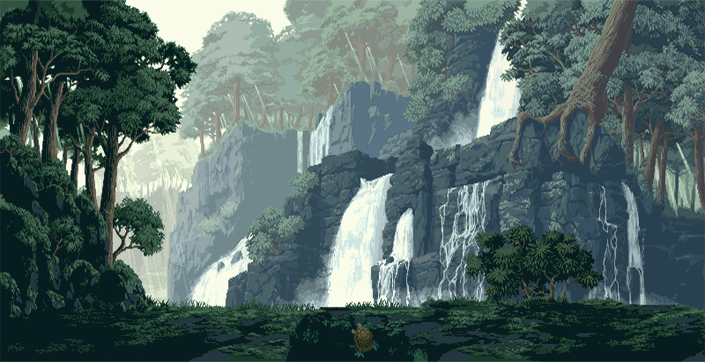

<h1>👋 Hey there, this is Soham!</h1>
<h3>Status: Compiling (3rd Year Comp-Eng)</h3>
 

<table width="100%">
<tr>
<td width="45%" valign="top">
<code>Keywords - Tech Stack</code>
  
<ul>
<li>Python, C / C++, Java</li>
<li>AI & Computer Vision</li>
<li>Network Programming</li>
<li>System level programming</li>
</ul>

 
<code>Side Quests</code>
  
<ul>
<li>Automating workflows</li>
<li>Grinding LeetCode algorithms</li>
<li>Chasing perfect mech keyboard sounds</li>
<li>Editing AMVs in DaVinci Resolve</li>
<li>Playing some music</li>
</ul>

 

</td>

<td width="55%" valign="top">
<code>The Architecture of Me</code>
  

I am a computer engineering student with a strong gravitation towards artificial intelligence, system-level programming, and building tools that make life easier.

Currently, my main focus is developing <i>WhoIsThat</i>, a facial recognition system, alongside a Jarvis-style virtual assistant. I enjoy bouncing between high-level Python scripting and dipping into lower-level concepts, like building out a Generalized Data Structure Library in C++.

 
<code>What I do in my free time</code>
  

When I'm not writing code for projects, I'm usually doing some creative stuff here and there like sketching and making art so I get my dopamine hit there.

</td>
</tr>
</table>

 

<code>Summary</code>
  
<blockquote>
Always learning, always building. My goal is to bridge the gap between complex algorithms and practical, everyday applications. Feel free to explore my code archive below to see what I've been working on lately.
</blockquote>

 

<i>Thank you for checking my code archive!</i>

<!-- 

<strong>👋 Hey there, this is Soham!</strong>

<strong>Status: Compiling (3rd Year Comp-Eng)</strong>

 

<h3 style="margin-top: 0;">Keywords - Tech Stack</h3>
<ul style="padding-left: 20px; margin-bottom: 0;">
<li>Python, C / C++, Java</li>
<li>AI & Computer Vision</li>
<li>Network Programming</li>
<li>System level programming</li>
</ul>

<h3 style="margin-top: 0;">Side Quests</h3>
<ul style="padding-left: 20px; margin-bottom: 0;">
<li>Automating workflows</li>
<li>Grinding LeetCode algorithms</li>
<li>Chasing the perfect mechanical keyboard sound profile</li>
<li>Editing AMVs in DaVinci Resolve</li>
<li>Play some music</li>
</ul>

<h3 style="margin-top: 0;">The Architecture of Me</h3>

I am a computer engineering student with a strong gravitation towards artificial intelligence, system-level programming, and building tools that make life easier.

Currently, my main focus is developing <i>WhoIsThat</i>, a facial recognition system, alongside a Jarvis-style virtual assistant. I enjoy bouncing between high-level Python scripting and dipping into lower-level concepts, like building out a Generalized Data Structure Library in C++.

<h3 style="margin-top: 0;">What i do in my free time</h3>

When I'm not writing code for projects, I'm usually doing some creative stuff here and there i like sketching and making art so i get my dopamine hit there.

 

<h3 style="margin-top: 0;">Summary</h3>

Always learning, always building. My goal is to bridge the gap between complex algorithms and practical, everyday applications. Feel free to explore my code archive below to see what I've been working on lately.

 

Thank you for checking my code archive!

 -->

